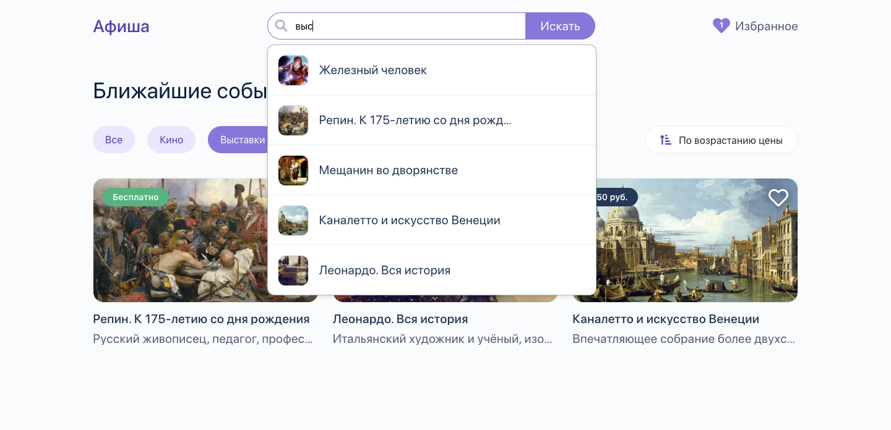

# Веб-приложение «Афиша»

Приложение представляет собой список событий, которые проходят в городе. Пользователь имеет возможность просматривать мероприятия, сортировать их и добавлять в избранное. Приложение адаптировано для использования как с десктопа, так и с мобильных устройств.

Проект сделан при помощи JavaScript-библиотеки React. Для хранения данных используется Firebase + LocalStorage (для списка избранных событий). Управление состоянием данных осуществляется через библиотеку Redux.

##### Скриншот главной страницы 


# Используемые технологии

- React 16
- ES6
- SCSS
- дополнительные npm-пакеты:
  * axios
  * redux
  * react-router-dom
 
# Возможности

- Просмотр афиши событий
- Просмотр отдельного события на его странице
- Сортировка по стоимости посещения
- Фильтры по типу события
- Добавление событий в список избранных и удаление из списка
- Хранение списка избранных событий в LocalStorage
- Сохранение состояния приложения между перезагрузками страницы
- Динамический поиск по заголовку и описанию события

##### Скриншот поля поиска 


# TODO
- [x] Просмотр афиши событий
- [x] Список избранных событий
- [x] Сортировка и фильтрация
- [x] Поиск по описанию / заголовку события
- [x] Хранение данных в Firebase и LocalStorage
- [x] Адаптивность под мобильные устройства
- [ ] Страница 404
- [ ] Адрес проведения события и метка с адресом на карте с помощью API Яндекс-карт
- [ ] Дата события и поиск по датам в календаре

# Демо/запуск проекта

Посмотреть можно по ссылке [https://mileor.github.io/affiche](https://mileor.github.io/affiche)

Чтобы запустить проект на своём компьютере — достаточно склонировать репозиторий и выполнить команды:
```
npm install
npm start
```
После введения команд готовый проект откроется в браузере автоматически.
